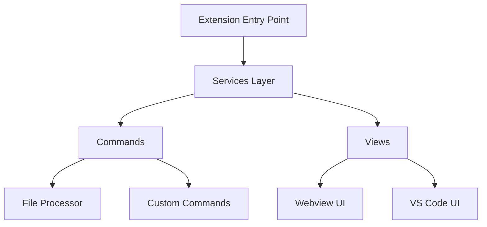
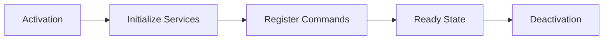
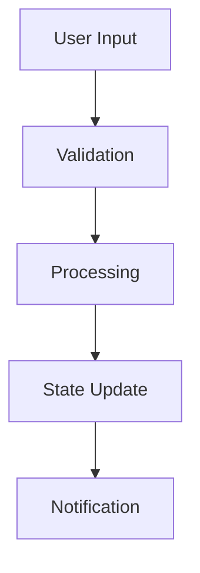
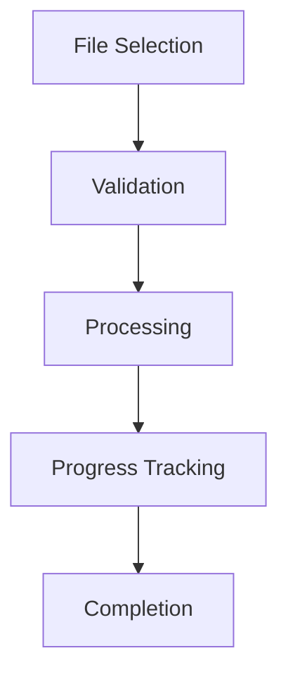

# System Patterns: Cody++

## Architecture Overview

### Core Components


### Directory Structure
- `/src`
  - `/commands` - Command implementations
  - `/constants` - Configuration and constants
  - `/services` - Core business logic
  - `/utils` - Shared utilities
  - `/views` - View controllers
  - `/webviews` - React-based UI

## Design Patterns

### Service Pattern
- Singleton services for core functionality
- Dependency injection through constructors
- Clear separation of concerns
- State management within services

Example:
```typescript
export class CustomCommandService {
  private static instance: CustomCommandService;
  
  public static getInstance(context: vscode.ExtensionContext): CustomCommandService {
    if (!CustomCommandService.instance) {
      CustomCommandService.instance = new CustomCommandService(context);
    }
    return CustomCommandService.instance;
  }
}
```

### Command Pattern
- Encapsulated command logic
- Consistent error handling
- Progress reporting
- Resource cleanup

Example:
```typescript
export async function addCustomCommand() {
  try {
    // Command implementation
    await showProgress();
    await validateInputs();
    await executeOperation();
  } catch (error) {
    handleError(error);
  } finally {
    cleanup();
  }
}
```

### Observer Pattern
- Event-driven communication
- WebView messaging system
- VS Code event handling
- State change notifications

### Factory Pattern
- View creation
- Command registration
- Service initialization
- Configuration management

## Technical Decisions

### State Management
1. VS Code Extension Context
   - Global extension state
   - Workspace state
   - Configuration storage

2. WebView State
   - React state management
   - VS Code messaging bridge
   - State persistence

### File Processing
1. Chunked Processing
   - Batch file operations
   - Progress tracking
   - Memory management

2. Path Handling
   - URI manipulation
   - Path normalization
   - Workspace relative paths

### Security Measures
1. Input Validation
   - Path sanitization
   - Command validation
   - User input verification

2. WebView Security
   - Content Security Policy
   - Message validation
   - Resource restrictions

## Component Relationships

### Extension Lifecycle


### Command Flow


### File Management Flow


## Implementation Guidelines

### Error Handling
- Consistent error types
- User-friendly messages
- Telemetry logging
- Recovery strategies

### Resource Management
- Proper disposal
- Memory optimization
- Event cleanup
- Context management

### Testing Strategy
- Unit tests for core logic
- Integration tests for commands
- WebView component testing
- E2E extension testing
